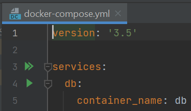
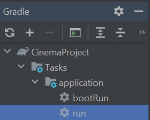

# Cinema Project by ParszywaZgraja

## Spis treści
* [Ogólne informacje](#ogólne-informacje)
* [Technologie](#technologie)
* [Setup aplikacji](#setup-aplikacji)
* [Model bazodanowy](#model-bazodanowy)
* [Model biznesowy](#model-biznesowy)

## Ogólne informacje
Aplikacja umożliwia prowadzenie własnego kina, w tym
utrzymywanie bazy pracowników, zarządzanie salami kinowym oraz
repertuarem filmowym.

## Technologie
Projekt został stworzony przy pomocy:
* Java 17
* Gradle
* Spring
* Docker
* PostgreSQL

Skorzystano również z następujących bibliotek:
* JavaFX
* JUnit5
* Lombok

## Setup aplikacji
Aby uruchomić projekt, należy postawić we własnym 
środowisku kontener Docker z bazą PostgreSQL, a następnie
uruchomić aplikację kliencką:
```
$ cd JK-sr-1300-ParszywaZgraja_Kino
$ docker compose up -d
$ .\gradlew run
```
Można to również uczynić z poziomu IDE Intellij:



## Model bazodanowy

Podczas dyskusji nad tematem przyjęliśmy następujące role:

- Admin (może wszystko co moderator + edycja i dodawanie nowych użytkowników)
- Moderator (może wszystko co kasjer + wprowadza zmiany w salach, ustala terminarz filmów)
- Kasjer (sprzedaje bilety)


Przyjęliśmy model, którego reprezentacja w diagramie ER wygląda tak:


Skorzystamy z bazy relacyjnej przez największe obycie z taką bazą.
Dokładną implementacją jednogłośnie przyjęliśmy PostgreSQL w wersji 12.2.
Aby ułatwić zadanie z uzyskaniem tej samej bazy przy zmianach korzystamy z kontenera Docker.

## Model biznesowy


