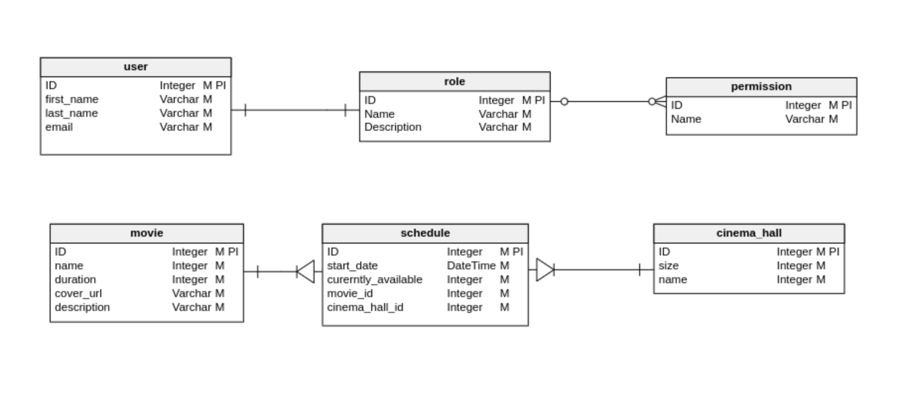

# Tytul

## Temat

### TODO

Podczas dyskusji nad tematem przyjęliśmy następujące role:

- Admin (może wszystko co moderator + edycja i dodanie nowych użytkowników)
- Moderator (może wszystko co kasjer + wprowadza zmiany w salach, ustala terminarz filmów)
- Kasjer (sprzedaje bilety)

## Model bazodanowy

Przyjęliśmy model, którego reprezentacja w diagramie ER wygląda tak:

Skorzystamy z bazy relacyjnej przez największe obycie z taką bazą.
Dokładną implementacją jednogłośnie przyjęliśmy PostgreSQL w wersji 12.2.
Aby ułatwić zadanie z uzyskaniem tej samej bazy przy zmianach korzystamy z kontenera Docker.

## Model biznesowy

### TODO

## Dodatkowe zależności

W celu zaoszczędzenia czasu na implementacji dodatkowych funkcjonalności skorzystaliśmy z bibliotek:

- lombok
- spring-boot-starter-mail

Wszystkie te zależności zarządzane są przez gradle.

