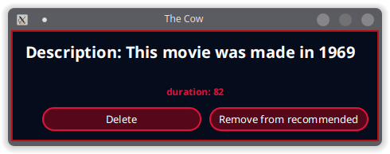
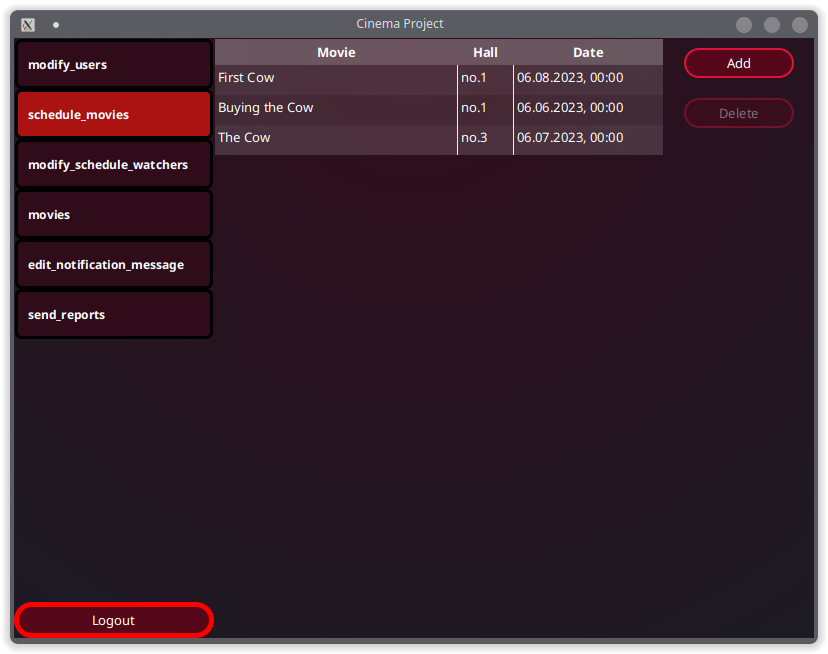
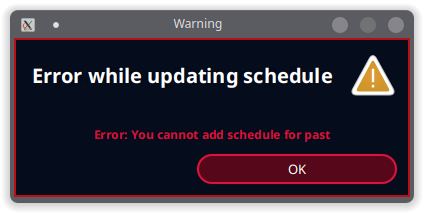

# Cinema Project by ParszywaZgraja

## Spis treści
* [Ogólne informacje](#ogólne-informacje)
* [Technologie](#technologie)
* [Setup aplikacji](#setup-aplikacji)
* [Model bazodanowy](#model-bazodanowy)
* [Komponenty](#komponenty)

## Ogólne informacje
Aplikacja umożliwia prowadzenie własnego kina, w tym
utrzymywanie bazy pracowników, zarządzanie salami kinowym oraz
repertuarem filmowym.

## Technologie
Projekt został stworzony przy pomocy:
* Java 17
* Gradle
* Spring
* Docker
* PostgreSQL

Skorzystano również z następujących bibliotek:
* JavaFX
* JUnit5
* Lombok

## Setup aplikacji
Aby uruchomić projekt, należy postawić we własnym
środowisku kontener Docker z bazą PostgreSQL, a następnie
uruchomić aplikację kliencką:
```
$ cd JK-sr-1300-ParszywaZgraja_Kino
$ docker compose up -d
$ .\gradlew run
```
Można to również uczynić z poziomu IDE Intellij:

<div align="center">


</div>

## Model bazodanowy

Podczas dyskusji nad tematem przyjęliśmy następujące role:

- Admin (może wszystko co moderator + edycja i dodawanie nowych użytkowników)
- Moderator (może wszystko co kasjer + wprowadza zmiany w salach, ustala terminarz filmów)
- Kasjer (sprzedaje bilety)


Przyjęliśmy model, którego reprezentacja w diagramie ER wygląda tak:

<div align="center">

</div>

Skorzystamy z bazy relacyjnej przez największe obycie z taką bazą.
Dokładną implementacją jednogłośnie przyjęliśmy PostgreSQL w wersji 12.2.
Aby ułatwić zadanie z uzyskaniem tej samej bazy przy zmianach korzystamy z kontenera Docker.

## Komponenty

1. [Strona logowania](#strona-logowania)
2. [Menu główne](#menu-gwne)
3. [Menadżer użytkowników](#menadżer-użytkowników)
4. [Zarządzanie filmem](#zarzdzanie-filmem)
5. [Sale w pliku konfiguracyjnym](#sale-w-pliku-konfiguracyjnym-json)
5. [Zarządzanie seansami](#zarzdzanie-seansami)
6. [Obsługa uprawnień](#obsuga-uprawnie)
7. [Zarządzanie sprzedażą biletów](#zarzdzanie-sprzeda-biletw)

### Strona logowania

Widok umożliwia zalogowanie się do aplikacji za pomocą adresu e-mail.
Adres wpisujemy w wyznaczone pole na środku powitalnego okna.

<div align="center">

</div>

Jeżeli zawartość pola nie spełna formatowania adresów email lub użytkownik o takim emailu nie został znaleziony w bazie,
odpowiednie komunikaty wyświetlą się pod polem.

<div align="center">


</div>

W przypadku pomyślnego zalogowania zostaniemy przekierowani do [głównego menu](#menu-gwne). W celach demonstracyjnych, adresem umożliwiającym
zalogowanie jest **admin@admin.pl**.

### Menu główne

Po zalogowaniu się do aplikacji zostajemy przekierowani do głównego widoku aplikacji.


Po lewej strony znajduje się panel z kilkoma zakładkami, dostepnymi w zależności od uprawnień użytkownika.

### Menadżer użytkowników

Po kliknięciu pierwszej zakładki zostaje nam wyświetlona lista wszystkich użytkowników z bazy.


Każdy z rekordów można edytować z poziomu klienta, zmiany pojawią się natychmiast w bazie danych.


Z prawej strony znajdują się również przyciski, umożliwiające dodanie i usuwanie użytkowników.

### Zarządzanie filmem

Przyjęliśmy, że dodawanie filmów w kompleksach kinowych nie jest wykonywane ręcznie i prędzej jest to pobiera z pewnej bazy (od jakiegoś dostawcy danych).
Nie dodawaliśmy więc dodatkowego widoku z możliwością dodania filmu.
Posiadamy za to osobny skrypt w jęzku Kotlin, który ściąga filmy z bazy [The Open Movie Database](https://www.omdbapi.com/).
Jest to raczej próba skupienia się na ważniejszych aspektach aplikacji takich jak kupowanie biletów oraz zarządzanie seansami niż stworzenie kolejnego przysłowiowego CRUD-a.

Pozostawiliśmy możliwość filtrowania i usuwania filmów w przeznaczonej do tego zakładce.


Pokazujemy tam 50 pierwszych filmów z wyszukania po tytule filmu oraz po minimalnej długości filmu.
Po kliknięciu w dany film możemy zobaczyć więcej szczegółów o nim, lub usunąć go z bazy danych.



Pomimo możliwości asynchronicznych zapytań oferowanych przez R2DBC,
natura Javafx powodowała, że aplikacja czasem dostaje lekkiego opoznienia,
gdy ściąga zdjęcia filmów (w `Platform.runLater(...)`).

### Sale w pliku konfiguracyjnym (json)

Ze względu na zmianę koncepcji w tym miejscu, sale ładowane przy starcie aplikacji zamiast trzymane w bazie danych, utworzyliśmy usunęliśmy wymagania `foreign key` w bazie.
Po tej zmianie dodaliśmy implementację Dao z salami jako In Memory Database, gdzie trzymamy mapę (Id, Sala) sal i wykonujemy na niej zapytania.


### Zarządzanie seansami

Mając bazę filmów oraz wczytane sale jesteśmy w stanie zaplanować
seans kinowy. Odbywa się to przez mechanizm analogiczny do
dodawania użytkowników, ztymże sprawdzanych jest więcej warunków (czy w planowanym terminie
dana sala nie jest już zajęta, czy planujemy seans w przyszłości).





### Obsługa uprawnień

Obsługujemy uprawnienia zgodnie z opisem w zakładce [Menu główne](#menu-gwne).
Podczas pojedyńczych operacji nie sprawdzamy dodatkowo uprawnień.
Autoryzacja do zasobów jest ustalana przy logowaniu użytkownika i nie jest zmieniana w trakcie działania programu.

### Zarządzanie sprzedażą biletów
