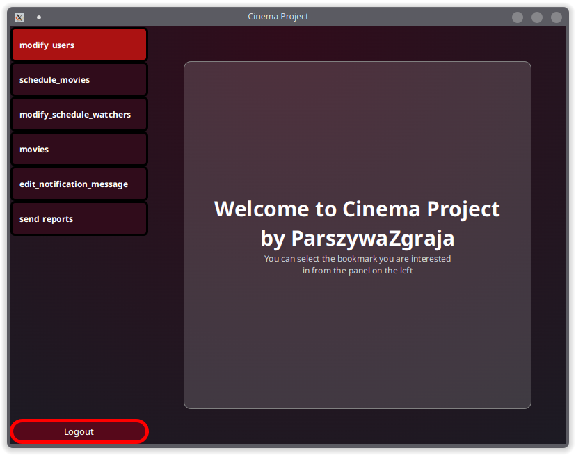
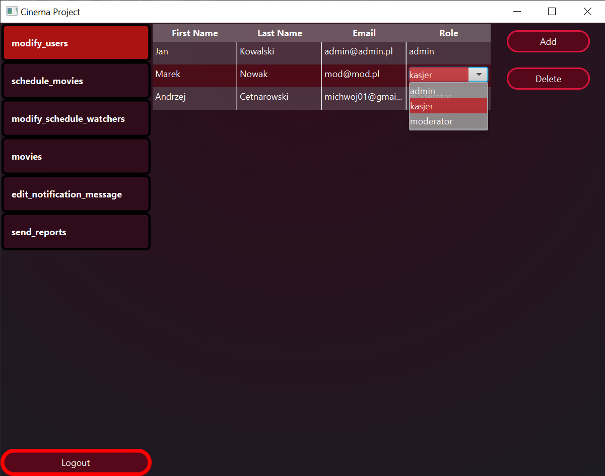
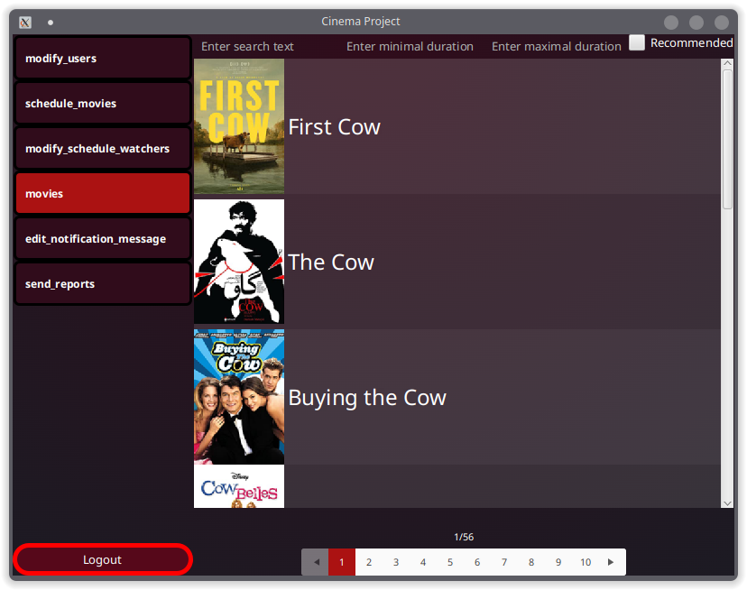
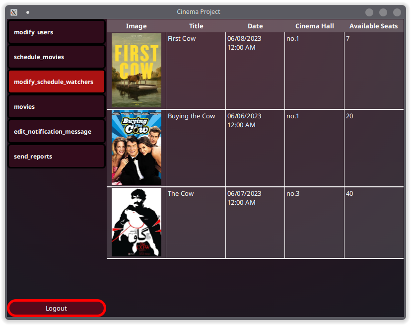
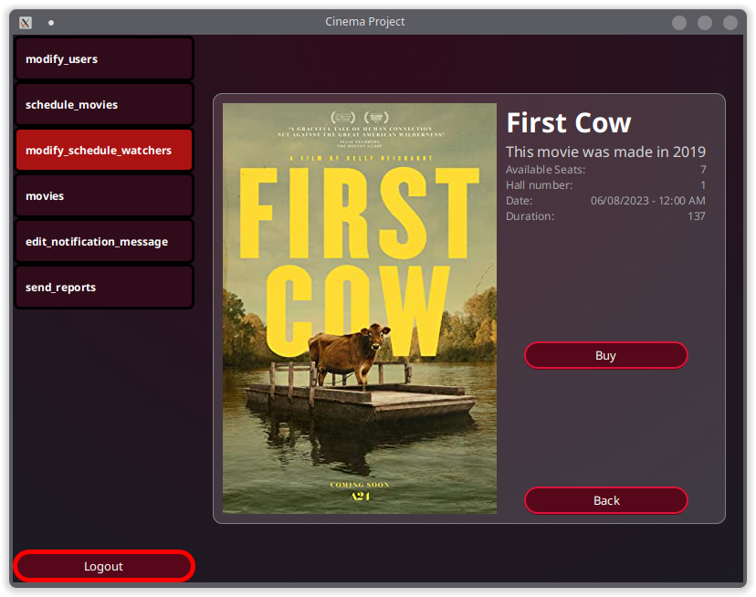
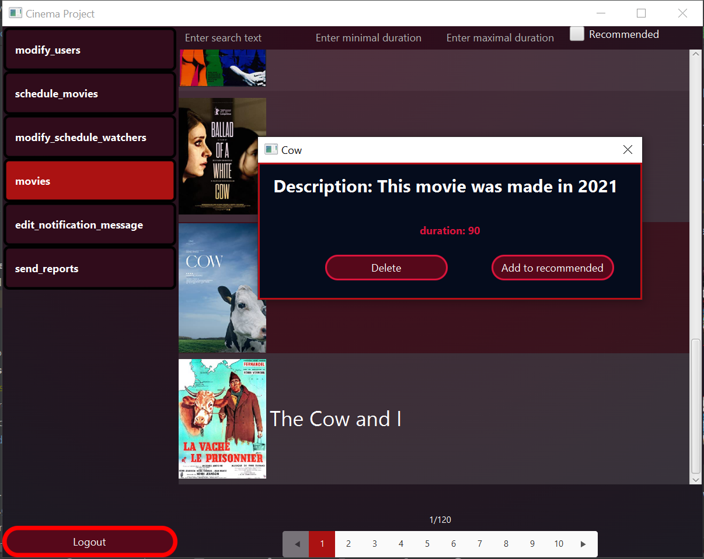
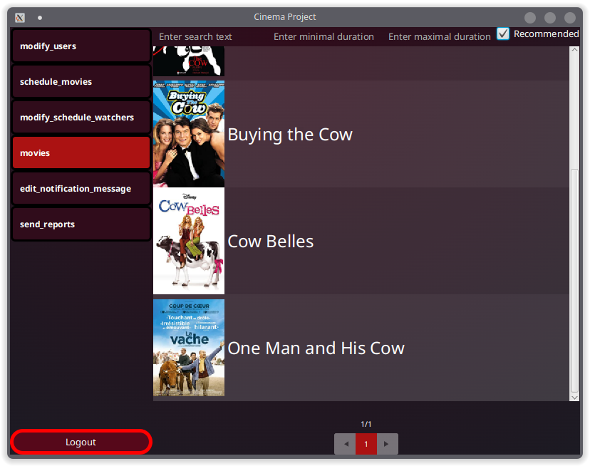
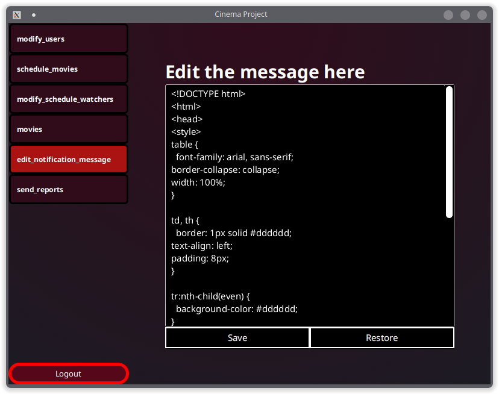
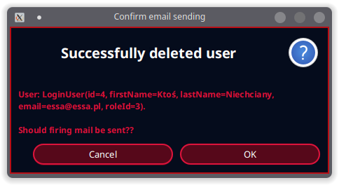

# Cinema Project by ParszywaZgraja

## Spis treści
* [Ogólne informacje](#ogólne-informacje)
* [Technologie](#technologie)
* [Setup aplikacji](#setup-aplikacji)
* [Model bazodanowy](#model-bazodanowy)
* [Komponenty](#komponenty)

## Ogólne informacje
Aplikacja umożliwia prowadzenie własnego kina, w tym
utrzymywanie bazy pracowników, zarządzanie salami kinowym oraz
repertuarem filmowym.

## Technologie
Projekt został stworzony przy pomocy:
* Java 17
* Gradle
* Spring
* Docker
* PostgreSQL

Skorzystano również z następujących bibliotek:
* JavaFX
* JUnit5
* Lombok

## Setup aplikacji
Aby uruchomić projekt, należy postawić we własnym
środowisku kontener Docker z bazą PostgreSQL, a następnie
uruchomić aplikację kliencką:
```
$ cd JK-sr-1300-ParszywaZgraja_Kino
$ docker compose up -d
$ .\gradlew run
```
Można to również uczynić z poziomu IDE Intellij:

<div align="center">


</div>

## Model bazodanowy

Podczas dyskusji nad tematem przyjęliśmy następujące role:

- Admin (może wszystko co moderator + edycja i dodawanie nowych użytkowników)
- Moderator (może wszystko co kasjer + wprowadza zmiany w salach, ustala terminarz filmów)
- Kasjer (sprzedaje bilety)


Przyjęliśmy model, którego reprezentacja w diagramie ER wygląda tak:

<div align="center">

</div>

Skorzystamy z bazy relacyjnej przez największe obycie z taką bazą.
Dokładną implementacją jednogłośnie przyjęliśmy PostgreSQL w wersji 12.2.
Aby ułatwić zadanie z uzyskaniem tej samej bazy przy zmianach korzystamy z kontenera Docker.

## Komponenty

1. [Strona logowania](#strona-logowania)
2. [Menu główne](#menu-gwne)
3. [Menadżer użytkowników](#menadżer-użytkowników)
4. [Zarządzanie filmem](#zarzdzanie-filmem)
5. [Sale w pliku konfiguracyjnym](#sale-w-pliku-konfiguracyjnym-json)
5. [Zarządzanie seansami](#zarzdzanie-seansami)
6. [Obsługa uprawnień](#obsuga-uprawnie)
7. [Zarządzanie sprzedażą biletów](#zarzdzanie-sprzeda-biletw)

### Strona logowania

Widok umożliwia zalogowanie się do aplikacji za pomocą adresu e-mail.
Adres wpisujemy w wyznaczone pole na środku powitalnego okna.

<div align="center">

</div>

Jeżeli zawartość pola nie spełna formatowania adresów email lub użytkownik o takim emailu nie został znaleziony w bazie,
odpowiednie komunikaty wyświetlą się pod polem.

<div align="center">


</div>

W przypadku pomyślnego zalogowania zostaniemy przekierowani do [głównego menu](#menu-gwne). W celach demonstracyjnych, adresem umożliwiającym
zalogowanie jest **admin@admin.pl**.

### Menu główne

Po zalogowaniu się do aplikacji zostajemy przekierowani do głównego widoku aplikacji.

<div align="center">

</div>

Po lewej strony znajduje się panel z kilkoma zakładkami, dostepnymi w zależności od uprawnień użytkownika.

### Menadżer użytkowników

Po kliknięciu pierwszej zakładki zostaje nam wyświetlona lista wszystkich użytkowników z bazy.

<div align="center">

</div>

Każdy z rekordów można edytować z poziomu klienta, zmiany pojawią się natychmiast w bazie danych.

<div align="center">

</div>

Z prawej strony znajdują się również przyciski, umożliwiające dodanie i usuwanie użytkowników.

### Zarządzanie filmem

Przyjęliśmy, że dodawanie filmów w kompleksach kinowych nie jest wykonywane ręcznie i prędzej jest to pobiera z pewnej bazy (od jakiegoś dostawcy danych).
Nie dodawaliśmy więc dodatkowego widoku z możliwością dodania filmu.
Posiadamy za to osobny skrypt w jęzku Kotlin, który ściąga filmy z bazy [The Open Movie Database](https://www.omdbapi.com/).
Jest to raczej próba skupienia się na ważniejszych aspektach aplikacji takich jak kupowanie biletów oraz zarządzanie seansami niż stworzenie kolejnego przysłowiowego CRUD-a.

Pozostawiliśmy możliwość, paginacji i usuwania filmów w przeznaczonej do tego zakładce.

<div align="center">

</div>

Pokazujemy tam około 1300 filmów z czego na każdą stronę przypada 10, wyszukania po tytule filmu ,minimalnej oraz maksymalnej długości filmu.
Po kliknięciu w dany film możemy zobaczyć więcej szczegółów o nim, lub usunąć go z bazy danych.

<div align="center">

</div>

Pomimo możliwości asynchronicznych zapytań oferowanych przez R2DBC,
natura Javafx powodowała, że aplikacja czasem dostaje lekkiego opoznienia,
gdy ściąga zdjęcia filmów (w `Platform.runLater(...)`).

### Sale w pliku konfiguracyjnym (json)

Ze względu na zmianę koncepcji w tym miejscu, sale ładowane przy starcie aplikacji zamiast trzymane w bazie danych, utworzyliśmy usunęliśmy wymagania `foreign key` w bazie.
Po tej zmianie dodaliśmy implementację Dao z salami jako In Memory Database, gdzie trzymamy mapę (Id, Sala) sal i wykonujemy na niej zapytania.

<div align="center">

</div>

### Zarządzanie seansami

Mając bazę filmów oraz wczytane sale jesteśmy w stanie zaplanować
seans kinowy. Odbywa się to przez mechanizm analogiczny do
dodawania użytkowników, z tymże sprawdzanych jest więcej warunków (czy w planowanym terminie
dana sala nie jest już zajęta, czy planujemy seans w przyszłości).

<div align="center">


</div>

### Obsługa uprawnień

Obsługujemy uprawnienia zgodnie z opisem w zakładce [Menu główne](#menu-gwne).
Podczas pojedyńczych operacji nie sprawdzamy dodatkowo uprawnień.
Autoryzacja do zasobów jest ustalana przy logowaniu użytkownika i nie jest zmieniana w trakcie działania programu.

### Zarządzanie sprzedażą biletów

Mając do dyspozycji ustalone seansy filmowe, jesteśmy w stanie zakupić bilety.

<div align="center">

</div>

Każdy z rekordów po kliknięciu, prowadzi nas do osobnego widoku przedstawiającego szczegółowe informacje, wraz z możliwością zakupu biletów na film.

<div align="center">

</div>

Pole z liczbą zakupionych biletów jest ograniczone do wpisania liczby z przedziału 0 do maksymalnej liczbą biletów dostępnych w danej chwili.

### Obsługa maili

Skorzystaliśmy z smtp4dev (docker container), aby móc testować wysyłanie naszym maili bez dostępu do faktycznego serwera stmp (wystawionego na świat).

Dodany został do docker-compose więc odpala się wtedy kiedy baza.
Następnie UI serwera znajduje się na adresie `localhost:3000`, a port do stmp to 2525.
Po wyłączeniu serwera jest on usuwany na zawsze (łącznie z logami o naszych wiadomościach :) ).

Zaimplementowaliśmy parę typów maili, w tym:
- powiadomienie o rekomendowanych filmach
- powiadomienie o zakończeniu współpracy z pracownikiem

#### Rekomendowane filmy

Z odpowiednią rolą `RECOMMENDED` mamy możliwość oznaczenia filmu jako rekomendowany.

<div align="center">

</div>

Możliwe jest filtrowanie po własności recommended (gdy włączone to tylko rekomendowane, gdy wyłączone to wszystkie).

<div align="center">

</div>


Następnie filmy tak oznaczone wysyłane są mailem do kasjerów. Filmy rekomendowane wysyłane są raz dziennie, co reguluje tabela `NOTIFICATION_LOG`. Wysyłanie następuje po zalogowaniu - Odpalany jest wątek niezależny od reszty aplikacji (w tym samym środowisku uruchumieniowym), po czym sprawdza co 15 sekund, czy nie wysłać powiadomienia. Zostało to zrealizowane przy pomocy biblioteki RXJava i `Observable::interval`.

<div align="center">

</div>

Treść notifikacji może nie sprostać wymaganiam klienta, więc udostępniliśmy możliwość edycji wiadomości w postaci HTML. Opcja ta jest dostępna tylko dla administratora.

<div align="center">

</div>

#### Zakończenie współpracy z pracownikiem

W przypadku zakończenia współpracy z pracownikiem, wysyłany jest mail wszystkich pracowników będących zatrudnionym.

<div align="center">

</div>

Email który zostaje wysłany wygląda tak:

<div align="center">

</div>

W celach humorystycznych nadaliśmy mu treść niezbyt miłą. W finalnym produkcie nigdy nie powinna się znaleźć taka wiadomość.
